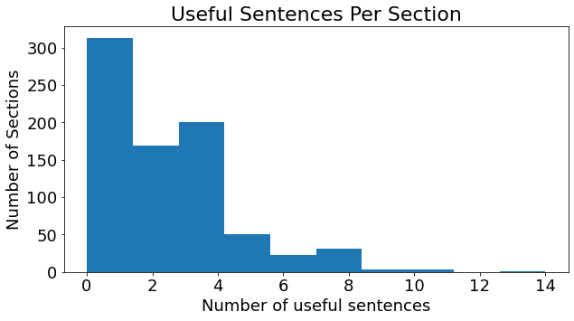
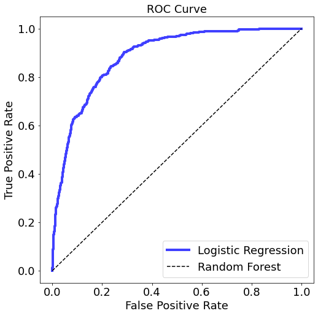

# Scraping company descriptions

## Objective: 

**Given a list of extracted sentences from company about pages, write and deploy a machine
learning classifier of your choice, that will determine whether or not the text contains descriptive
content.**

<ins>**Utility to Pitchbook**<ins>
* Identify useful information about target companies.
* Filter useless information out of downstream classification pipelines.
* Provide access to predictions through a fully containerized EC2 deployment.

## The solution

### Part 1a:

**First I performed basic exploratory data analysis and cleaning. This consisted of four parts:**

* **1. Basic dataset exploration**: Explore data shape, types, check for missing data, etc.
* **2. Text cleaning**: The first stage of preprocessing consisted of tokenization, part of speech tagging, lemmatization, and stop word removal. In the interest of time, I chose to remove all puncuation, reduce all upper case letters, and keep only alphanumeric characters. Future iterations could do a more thorough job here.
* **3. Exploratory data analysis**: Here I looked at distributions of labels, and found a large label imbalance. This was expected as most sentences are likely to be without useful information. I also looked at the distribution of useful sentences in a particular about section. Given more time, it could be useful to explore a two step classification (1) to predict if an about section will have useful sentences (or how many), and then to predict the utility of a sentence. Finally, I looked at word counts across the entire dataset. Useful sentences are often longer, and this feature could be built in to a classifier, possibly by just looking at the magnitude of the resulting word vectors. `exploratory.ipynb` contains further analysis and comments.

* **4. Baseline model generation**: In order to quickly generate a baseline model, I used a bag of words approach to build an unweighted word matrix as input to a logistic regression model. The baseline model, while misclassifying about half of the useful sentences, was at least able to filter a large fraction of the useless sentences, a potentially useful feature. More importantly, this provided a baseline to generate better models. `alternative_models.ipynb` contains further analysis and comments.

### Part 1b:

**Next I sought to explore model space in more detail as well as employ a potentially more powerful model input**

* **1. TFIDF:**: Rather than simple bag of words inputs, I instead sought to generate a tfidf matrix. This should provide better weighting for potentially useful words. 
* **2. Model building and evaluation**: I chose logistic regression, random forest classification, and a KNN as three models to test. These models are generally fast and lightweight making them amenable to deployment in real time. Of the three models, the untuned KNN perfprmed least well by sensible metrics (precision, recall, AUC). The logistic regression and random forest classifier performed similarly by AUC, but threshold tuning would be necessary for the RFC. Given time constraints and the simpler nature of logistic regression hyperparameter tuning, I chose to move forward with a TFIDF Logistic regression classifier. 
* **3. Hyperparameter tuning and validation**: The tuned model showed a 17% increase in recall over the baseline model with minimal loss in precision.

### Part 2:

**Model deployment considerations**

* **1. Use case considerations**: Model interaction will dictate how the model is deployed. The assumption for this model is that it does not need a clean UI for customer interaction. This model will exist as part of a top level web scrapig infrastructure in order to filter useful data for down stream classifications. As such, methods for passing formatted data, and returning predictions should be sufficient. 
* **2. Stragegy**: I chose to use FastAPI to set up a lightweight method for model training, testing, and inference. This allows for straightforward interaction, automatic documentation, has been dockerized and is ready to deploy to an EC2 instance. 

